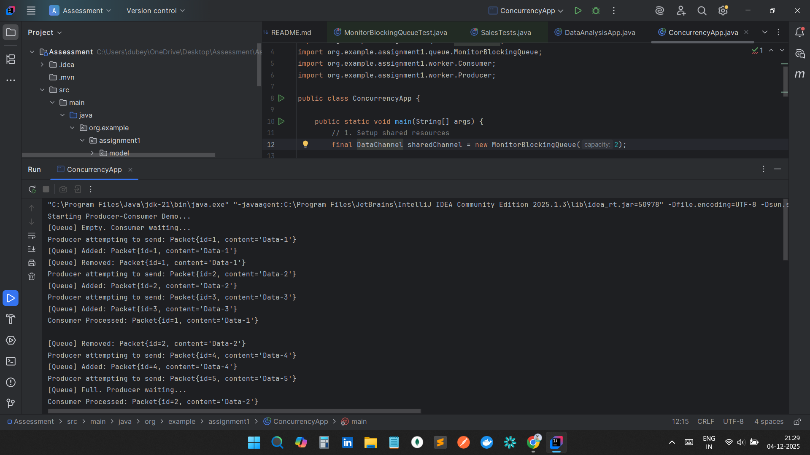
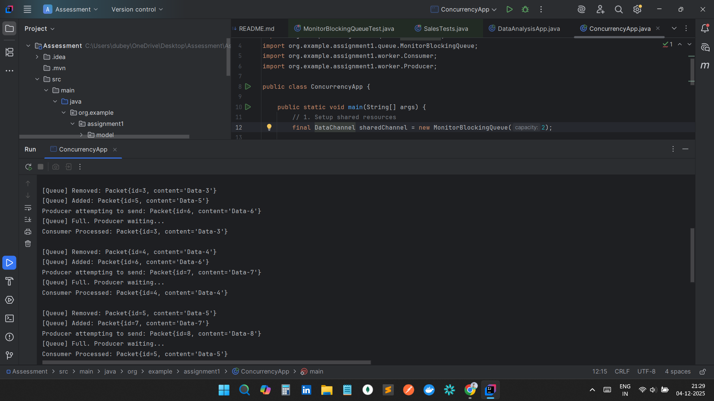
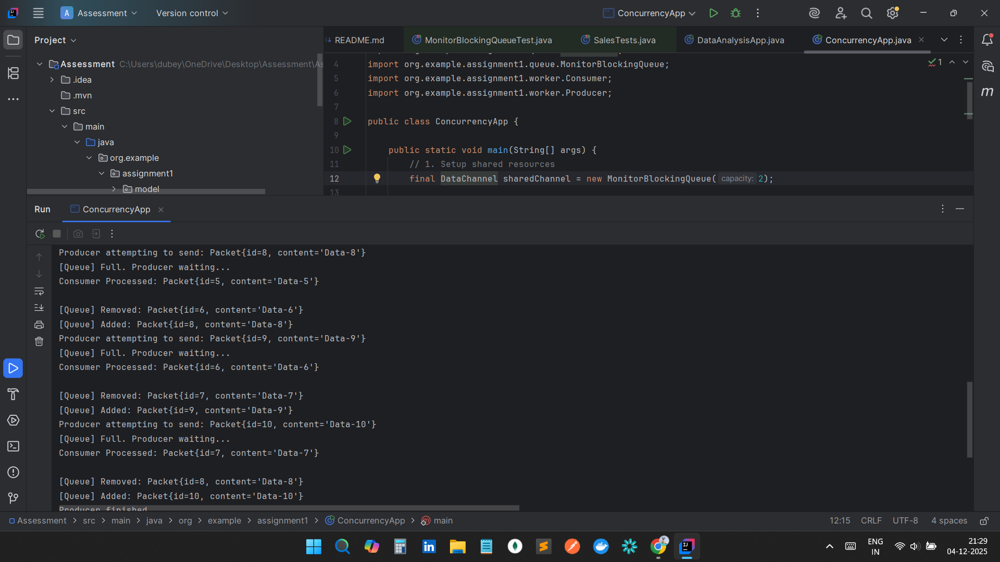
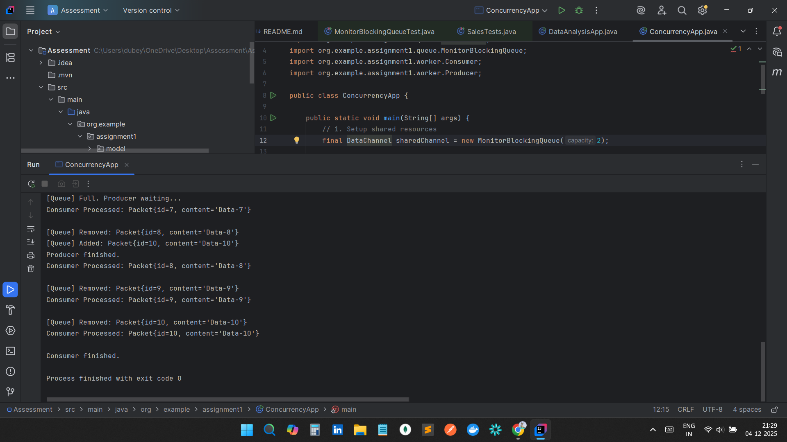
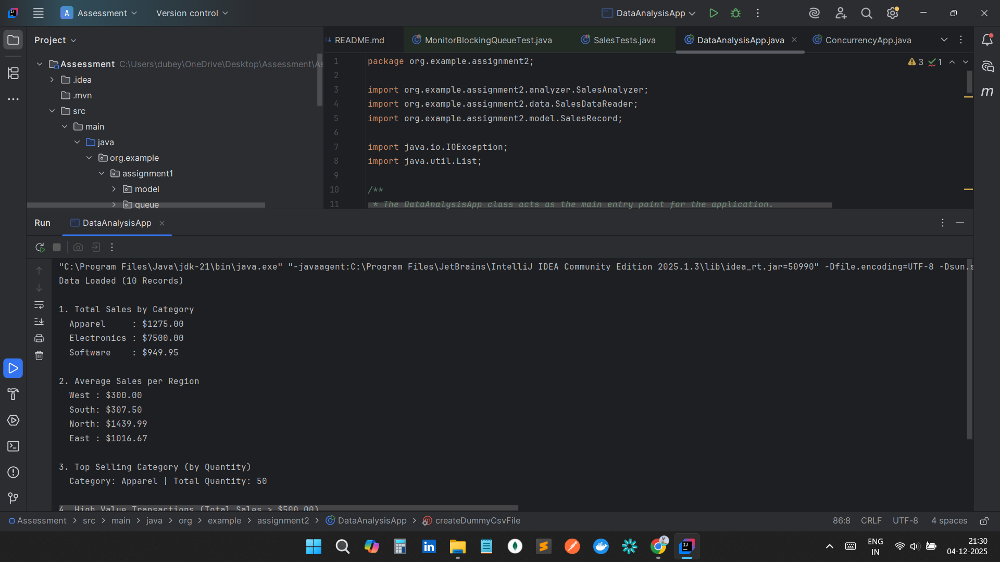
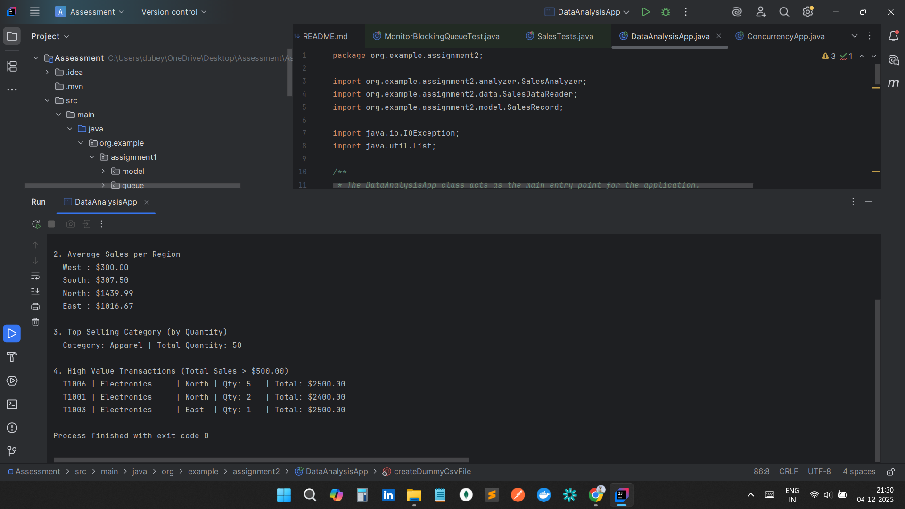
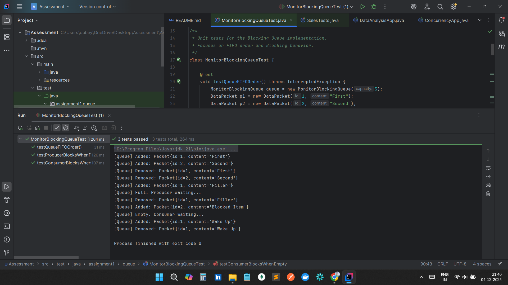
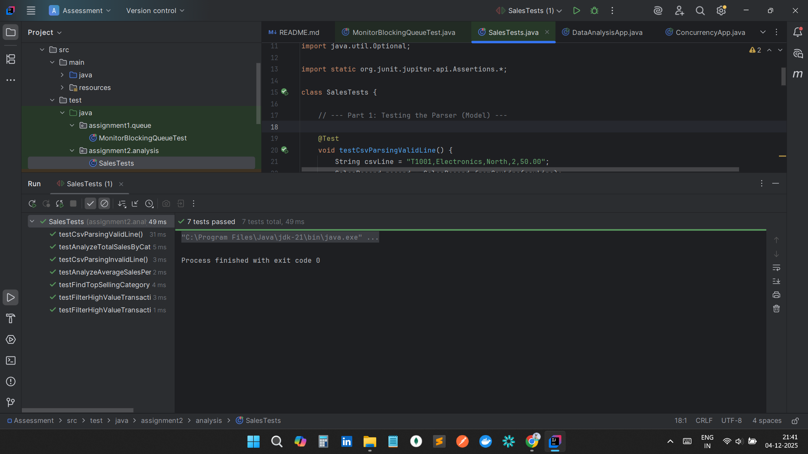

Java Advanced Concepts: Concurrency & Functional Programming

This repository contains the implementations for Assignment 1 (Producer-Consumer Pattern) and Assignment 2 (Data Analysis with Streams). Both projects demonstrate advanced Java capabilities including multi-threading, synchronization, and functional data processing.

🚀 Assignment 1: Producer-Consumer Pattern

Overview

This module implements a classic Producer-Consumer pattern to demonstrate thread synchronization without using Java's built-in BlockingQueue. Instead, it uses a custom MonitorBlockingQueue implemented with low-level wait() and notifyAll() mechanisms.

Key Features

Thread Safety: Custom implementation of a blocking queue using Monitors.

Separation of Concerns: Producer and Consumer are decoupled via the DataChannel interface.

Graceful Handling: Handles InterruptedException and manages thread states.

How to Run

Navigate to the src directory and you can run the main file (ConcurrencyApp class.)

📸 Sample Output

Below is a screenshot demonstrating the Producer waiting when the queue is full and the Consumer waiting when the queue is empty.

Note: If the image above is not visible, please check the screenshots folder in the source code.

📊 Assignment 2: Data Analysis with Streams

Overview

This module performs complex data aggregation on CSV sales data using Java's Stream API. It demonstrates functional programming concepts such as lambdas, method references, and collectors (groupingBy, summingDouble, etc.).

Key Analysis Performed

Total Sales by Category: Groups transactions and sums revenue.

Average Sales per Region: Calculates average transaction value per region.

Top Selling Category: Finds the category with the highest quantity sold.

High-Value Transactions: Filters and sorts transactions exceeding a specific threshold.

How to Run

Navigate to the src directory.

You can use IDEA to run the main file (DataAnalysisApp class)

📸 Analysis Results

Below is the console output showing the statistical analysis of the sales data.

🧪 Testing

Unit tests are implemented using JUnit 5 to verify logic and thread safety.

Running Tests

You can run the tests using your IDE (IntelliJ/Eclipse) or via Maven:

mvn test

Test Coverage

MonitorBlockingQueueTest: Verifies FIFO order and blocking behavior (Producer blocks on full, Consumer blocks on empty).

SalesTests: Verifies CSV parsing logic and correct calculation of totals/averages.

📸 Test Execution

Screenshot showing all JUnit tests passing.

